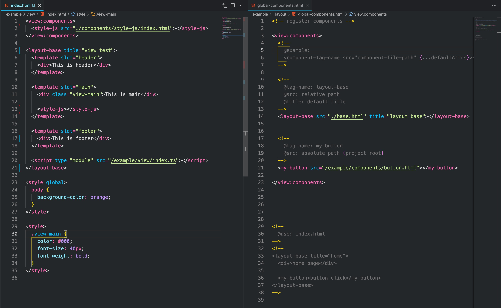

# vite-plugin-posthtml-view

<div align="center">
  
</div>

## Template expression

PHP applications require PHP installed

- [posthtml-expressions](https://github.com/posthtml/posthtml-expressions)

## Install

```bash
npm i -D posthtml-view
```

## Major TODOs:

- [ ] view:-if, view:-for ...
- [ ] component script
- [ ] async components
- [ ] fix hot update
- [ ] development cache
